# UESTC Healthy Report

## 免责声明

本项目基于*python-selenium*与*geckodriver*实现在*Firefox*浏览器上模拟使用者每日登录并提交健康信息的操作。打卡所涉及信息默认为使用者上次打卡信息，本项目对打卡信息未进行任何修改。当您使用本项目，默认您知悉并同意以历史信息作为当前健康状况进行上报。

**注意：如果您存在任何信息变更：如中高风险旅居史、时空密接等，请暂停项目并立刻上报！若因为瞒报、错报信息而造成严重后果，与本项目及相关维护者无关！**

**当您参照下列操作进行部署时，默认同意上述免责声明。**

## 更新历史

1. V1.0（21-12-20）：基础代码构建，滑块逻辑实现
2. V1.1（22-05-28）：修复滑块失败重复尝试，设定actions执行，增加飞书webhook提示
3. V1.2（22-06-05）：完善文档，修改定时执行时间。
3. V1.2.1（22-11-23）：修复依赖版本问题，指定兼容版本；补充文档。

## 项目效果

全自动实现登录+打卡流程演示：

该动图展示为有头模式下模拟效果，**在Linux服务器上运行时必须指定为无头模式**。

## 快速部署

### 写在前面

由于Github新政策的影响，**仓库若两个月内无活跃操作，将停止运行并关闭Workflow**。

若要恢复需要手动开启，**当被关闭后手动点开仓库 Actions - 本workflow - Enable workflow 即可恢复，并非脚本失效！**

### 基于 Github Workflow 

本项目代码支持使用Github workflow进行快速部署，无需服务器资源和繁杂的个人设定即可实现定时执行、自动通知结果等功能。

1. 进入[仓库](https://github.com/imcyx/UESTC_Report)，`fork`该项目（当然，也希望可以点个star支持一下🤭）：

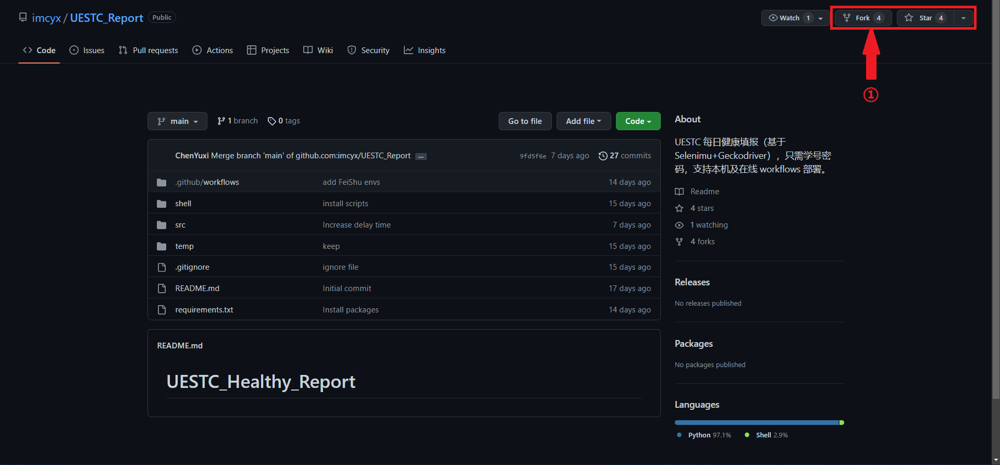

然后直接选择`Create Fork`即可完成仓库的拷贝。

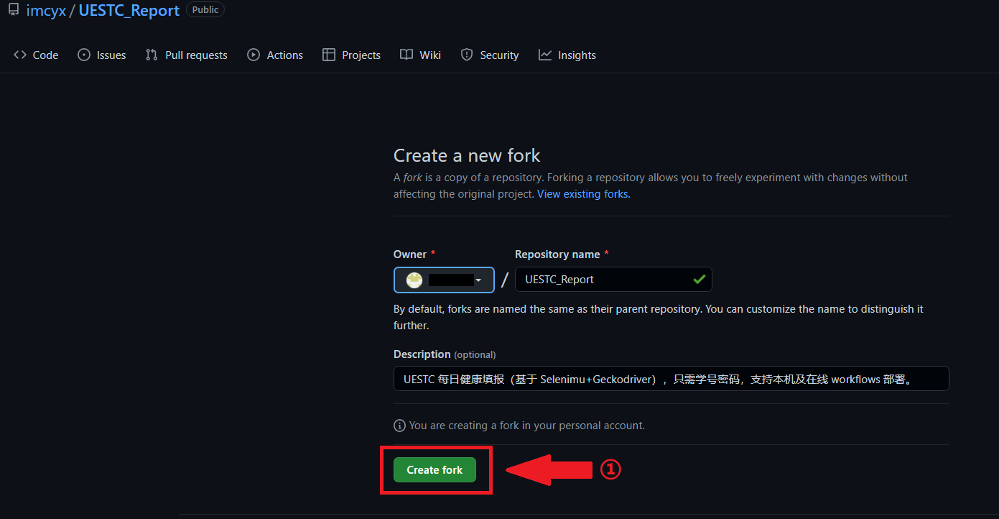

2. 在`fork`后的仓库，选择`Actions`，点击`I understand my workflows, go head and enable them`，

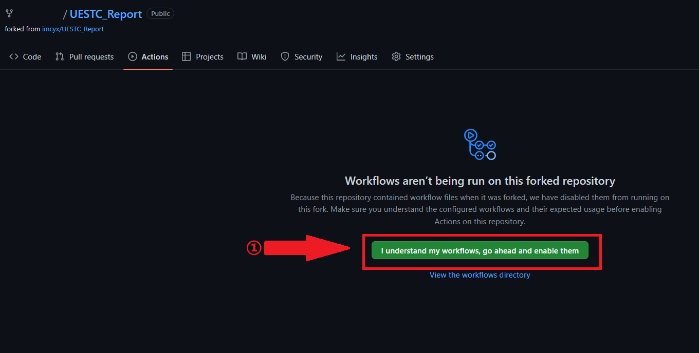

然后再选择`Daily Report`的 workflow，选择`Enable workflow`，即可完成项目在Github服务器部署自动定时执行。

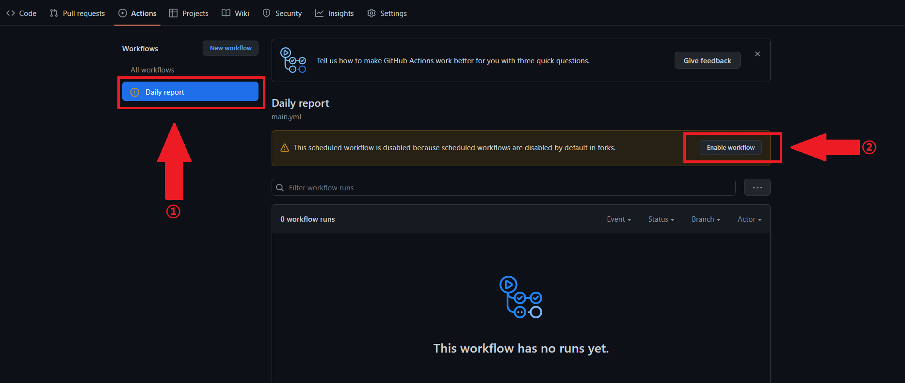

3. 最后，进入`Settings->Secrets->Actions`，选择`New repository secret`：

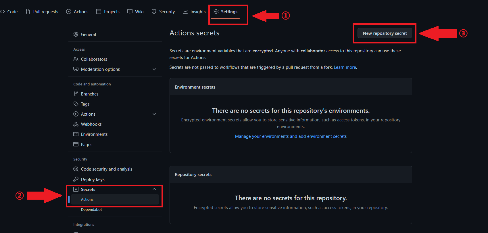

新建命名为`LOGIN`的密钥，`Value`为学号密码，中间由`#`隔开（注意，输入的学号密码之间不要有空格！）。输入完成点击`Add secret`。

至此，自动打卡工程已经部署完成，我们可以回到`Actions`里手动执行一次查看运行效果：

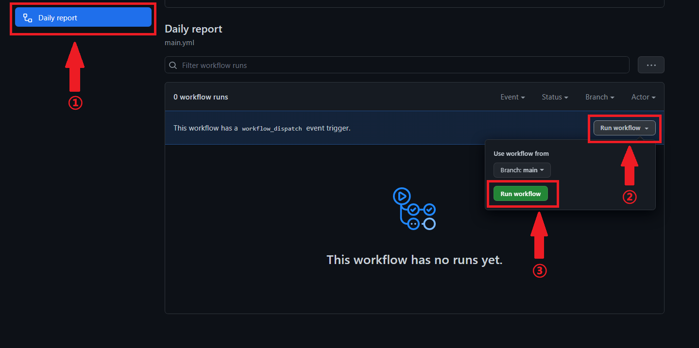

执行成功后可以看到结果如下，正常执行大概需要60~120s，视打卡当时服务器波动情况。

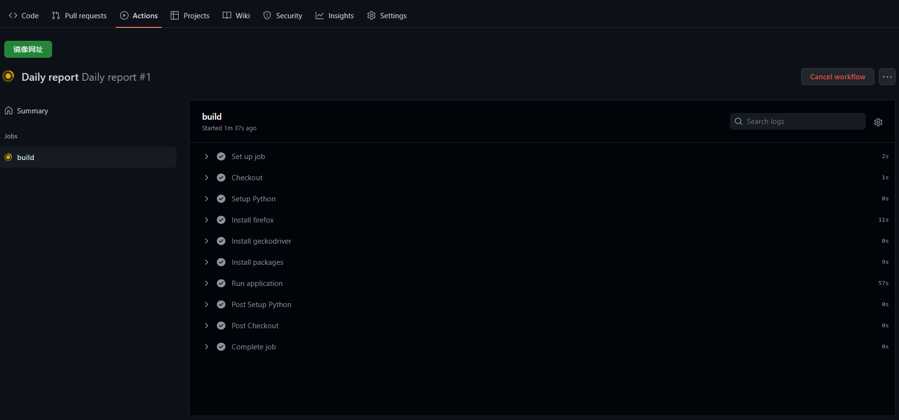

如果想自己设置自动打卡的时间，可以修改`UESTC_Report/.github/workflows/main.yml`文件中的`cron`，具体格式请自行百度。

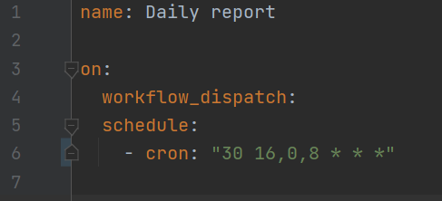

4. （可选）本项目集成了飞书的通知功能。如果需要查看打卡的具体结果，可以使用飞书webhook功能。具体部署方法如下：

   第一步，打开电脑版飞书（手机版似乎没有办法添加自定义机器人），新建一个只有自己的对话，重命名后点击创建：

   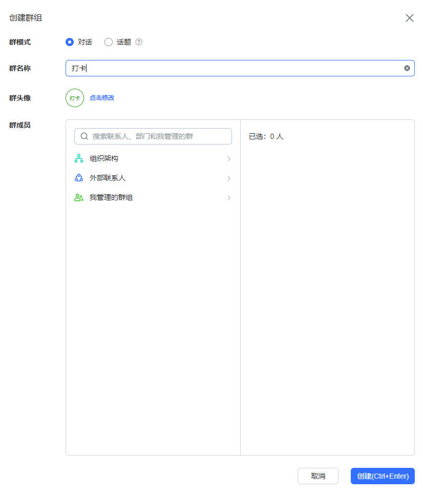

   第二步，选择`群设置->群机器人->添加机器人`，
   
   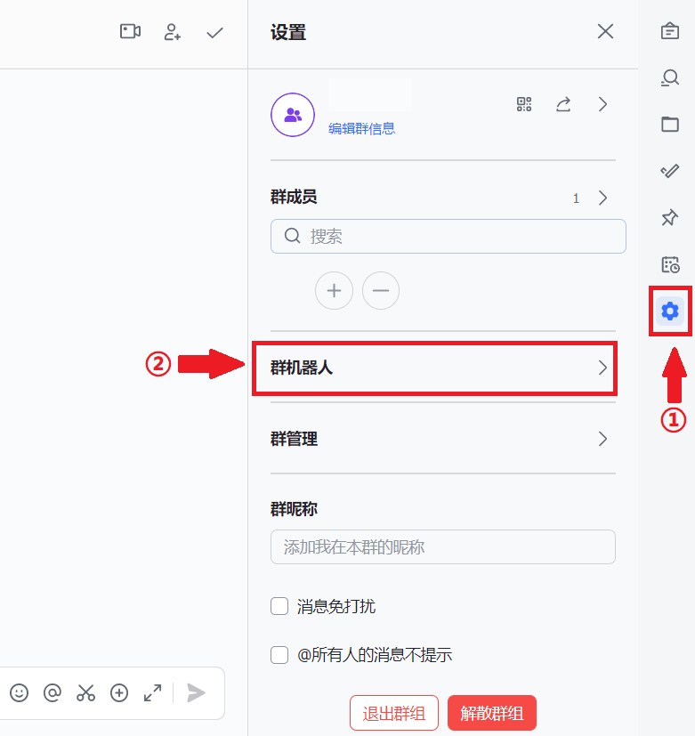
   
   选择`自定义机器人`，配置好名称和描述后，复制`webhook`地址。
   
   
   
   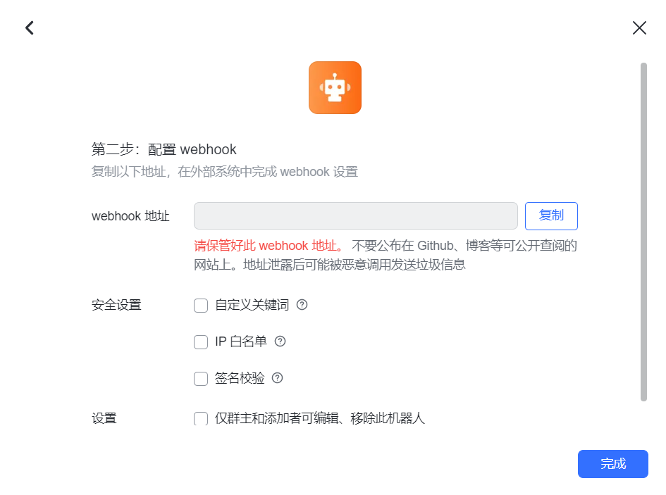

   第三步，进入`Settings->Secrets->Actions`，选择`New repository secret`，新建命名为`NOTICE`的密钥，`Value`填入`webhook`地址，输入完成点击`Add secret`。

   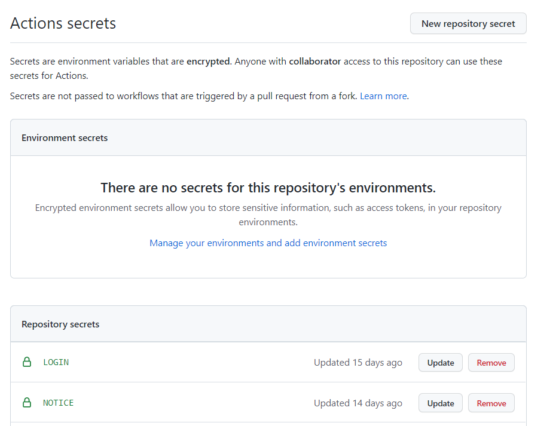

   这样自动通知就部署完成了，每当打卡代码执行完成时，飞书端会发送通知：
   
   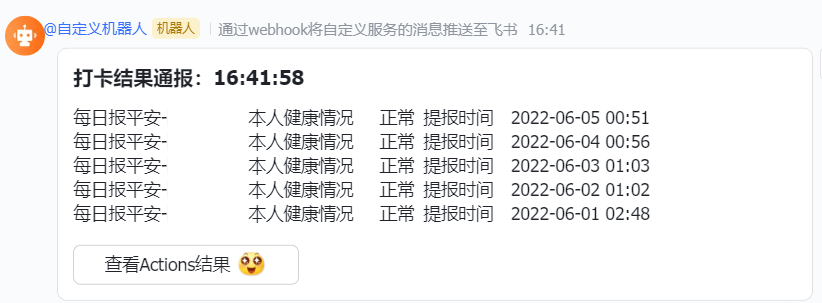
   
   如果需要自定义提示消息形式，可以参照飞书开发文档：
   
   > 自定义机器人指南：https://open.feishu.cn/document/ukTMukTMukTM/ucTM5YjL3ETO24yNxkjN

### 基于自有 Linux 服务器

与快速部署在Github服务器不同，部署自有服务器有三点主要的不同。

1. 需要安装Python并安装依赖` requirements.txt`，建议python安装3.8版本及以上，并为本项目建立独立虚拟环境。
2. 需要优先安装符合版本要求的`Firefox`和`Geckodriver`。可以直接使用在线部署的shell脚本安装，直接用管理员权限执行两个脚本即可。
3. 需要修改`src/config.json`文件里的配置，主要包括：
   a. 修改`online`选项为`false`。
   b. 设置`offline_deployment`里的参数，包括账号密码，webhook地址，（如果按照脚本安装geckodriver，其已经移动到/usr/local/bin目录下，可以直接设置为空）。

完成部署后，既可以手动运行`main.py`，也可设置一个后台线程定时执行，打卡流程与github上部署本质上一致。

### 基于 Windows 部署

Windows部署除了需要自行下载Firefox浏览器与Geckodriver，其它与Linux一致。二者下载地址分别为：

> Firefox镜像：https://download-installer.cdn.mozilla.net/pub/firefox/releases/
>
> Geckodriver：https://github.com/mozilla/geckodriver/releases

注意，两者之间必须按照对应关系安装，否则工程执行将会出错。两者版本对应关系如下：

> 版本对应表：https://firefox-source-docs.mozilla.org/testing/geckodriver/Support.html

安装完成后，将Geckodriver地址填入`src/config.json`即可。

Windows定时执行可以自行编写bat或者js脚本调用本项目执行，再将脚本放在Windows开机自启动文件夹下实现每天开机时自动执行。

## 其它事项

1. 代码执行存在一定的失败几率，建议每天定时执行至少3次，基本可以保证百分百打上。
2. 部署Github的Workflow时，务必注意**不要在任何公开区域透露个人系统账号密码**。一旦暴露，你的密码可能被任何人盗取并进行危害性的操作，务必注意！
3. 如果出现连续打卡失败，可能是系统登录地址或者填报地址变更，请及时关注本仓库。

